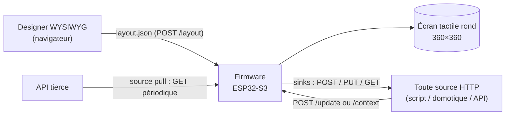

<p align="center">
  
</p>

<h1 align="center">Dialboard</h1>

<p align="center">
  <strong>Conçois des dashboards dans ton navigateur et pousse-les sur un écran tactile <em>rond</em> à ~15 €.</strong>
</p>

<p align="center">
  <a href="https://sandjab.github.io/Dialboard/">Site</a> ·
  <a href="https://sandjab.github.io/Dialboard/docs/">Manuel</a> ·
  <a href="https://github.com/Sandjab/dialboard-store">Store communautaire</a>
</p>

<p align="center">
  
  
  
  
  
</p>

<p align="center">
  <a href="README.md">English</a> · <strong>Français</strong>
</p>

---

Dialboard transforme un écran tactile **rond** ESP32-S3 bon marché (Guition JC3636K718, 360×360)
en **dashboard piloté par configuration**. Un layout JSON décrit les pages et les composants ; un
**designer WYSIWYG** — une web app statique embarquée sur le device lui-même — édite ce layout sans
recompiler ; et les valeurs sont **poussées depuis n'importe quelle source HTTP** via un simple
`POST /update`.

Pas d'appli, pas de compte cloud, pas de toolchain au quotidien : on flashe une fois, puis on
conçoit dans le navigateur et on alimente l'écran depuis ses scripts, sa domotique ou des API
tierces.

## Sommaire

- [Points forts](#points-forts)
- [Matériel](#matériel)
- [Fonctionnement](#fonctionnement)
- [Structure du dépôt](#structure-du-dépôt)
- [Démarrage rapide](#démarrage-rapide)
- [Utiliser le designer](#utiliser-le-designer)
- [Composants](#composants)
- [Pousser des données à l'écran](#pousser-des-données-à-lécran)
- [API HTTP](#api-http)
- [Format du layout](#format-du-layout)
- [Build, tests & flash](#build-tests--flash)
- [Développement](#développement)
- [Pile technique](#pile-technique)
- [Limites & notes de sécurité](#limites--notes-de-sécurité)
- [Liens](#liens)
- [Contribuer](#contribuer)

## Points forts

- **Piloté par configuration** — toute l'UI tient dans un seul `layout.json` ; aucune
  recompilation pour changer l'écran.
- **Designer WYSIWYG, embarqué** — éditeur glisser-déposer servi *par le device* via LittleFS
  (`http://<ip>/designer/`), utilisable aussi en local ou depuis GitHub Pages. Canvas multi-pages
  avec snap aux ancrages, validation live du schéma, undo/redo, import/export.
- **Pousser depuis partout** — écrire la valeur d'un composant par son id (`POST /update`) ou
  écrire un **contexte** (tableau noir partagé, `POST /context`).
- **Sources pull** — le device peut `GET` périodiquement des API tierces et en extraire des champs
  par JSON Pointer vers le contexte (`temp`, `co2`, …).
- **Sinks réactifs** — une interaction UI peut `POST/PUT/GET` un endpoint externe (domotique,
  webhooks) avec débounce — un bus HTTP bidirectionnel.
- **Effecteurs de saisie** — switches, sliders, boutons, rollers, steppers, contrôles segmentés
  réécrivent le contexte et reflètent les valeurs poussées.
- **Provisioning au runtime** — identifiants WiFi via un **portail captif** (stockés en NVS, pas
  dans le binaire) ; secrets d'API via un store write-only, référencés par `$nom` dans les headers.
- **Flasher depuis le designer** — mises à jour OTA firmware/filesystem sur le LAN, et flash USB
  (Web Serial) pour bootstrapper un device vierge — sans toolchain locale.
- **Parité par conception** — un schéma JSON unique (`schema/layout.schema.json`) est le contrat
  partagé, validé à la fois par le designer et par le firmware.

## Matériel

Cible principale : **Guition JC3636K718**.

| | |
|---|---|
| MCU | ESP32-S3 (double cœur, PSRAM) |
| Écran | IPS **rond** 360×360, contrôleur ST77916 en QSPI |
| Tactile | CST816 capacitif (mono-point) |
| Entrée | encodeur rotatif avec appui |
| Extras | anneau RGB adressable (WS2812), audio, lecteur microSD |
| Flash | 16 Mo (table de partitions dédiée : double slot app OTA + LittleFS) |
| Coût | ~15 € |

La couche carte (pins, séquences d'init, drivers) est isolée dans `lib/board_k718/` avec les
symboles `k718_*`. L'identité applicative est **Dialboard** ; la couche carte garde une identité
board-spécifique pour soutenir le portage futur vers d'autres écrans ronds.

## Fonctionnement

Trois éléments autour d'un contrat partagé :



1. On **conçoit** un layout dans le navigateur et on le pousse au device ; il est validé et
   persisté en flash.
2. Le firmware le **rend** avec LVGL et expose une petite API HTTP.
3. On l'**alimente** : push direct de valeurs, écriture du contexte, ou pull depuis des API.
4. Les **interactions** sur l'écran peuvent déclencher des appels HTTP sortants (sinks).

Le bus contexte/pull/push — le cœur du flux de données de Dialboard — est documenté en détail dans
[`context.md`](context.md) : concurrence, résolution des secrets, cycle de vie des sinks.

## Structure du dépôt

```
src/                Firmware (C++/Arduino, LVGL 9.5) : dashboard, view, api, net_pull/push, persist, nav…
lib/
  board_k718/       HAL de la carte (pins, écran ST77916, init LVGL, encodeur, anneau RGB) — symboles k718_*
  qspi_panel/       Driver du panneau QSPI
  esp_lcd_touch*/   Driver tactile CST816 vendorisé (absent du registre PlatformIO)
designer/           Éditeur WYSIWYG (modules ES + tests node), embarqué on-device via LittleFS
schema/             layout.schema.json — le contrat partagé (designer ET firmware)
data/               Image LittleFS : layout.json (committé) + designer/ + schema/ (stagés)
test/               Tests natifs du cœur logique (Unity, env:native)
tools/              stage_fs.sh (stage data/), push.py, gen_fonts.py
docs/               Manuel HTML (index.html)
site/               Landing page bilingue (GitHub Pages)
context.md          Plongée en profondeur : le contexte tableau noir + le bus pull/push
```

## Démarrage rapide

**Prérequis :** [PlatformIO](https://platformio.org/) (CLI ou IDE) et un câble USB. Node.js sert
seulement à lancer les tests du designer. Python 3 + `fonttools`/`brotli` servent seulement à
régénérer les fontes.

```bash
# 1. Builder et flasher le firmware
pio run -e esp32s3 -t upload

# 2. Stager le designer + le schéma, puis flasher l'image LittleFS
bash tools/stage_fs.sh
pio run -e esp32s3 -t uploadfs
```

**Premier boot — provisioning WiFi.** Sans réseau connu, le device ouvre un point d'accès ouvert
`Dialboard-XXXXXX` avec un **portail captif** pour saisir les identifiants WiFi, puis redémarre.
Les identifiants sont stockés en NVS (partition distincte — ils survivent à `uploadfs`).

Une fois connecté, le device est joignable à son IP DHCP (et `dialboard.local` via mDNS là où c'est
autorisé). Ouvrir **`http://<ip>/designer/`** pour commencer à concevoir.

> ⚠️ `pio run -t uploadfs` réécrit tout le filesystem LittleFS et **efface les assets on-device**
> (images uploadées, `/secrets.json`). Les sauvegarder avant de reflasher le filesystem.

## Utiliser le designer

Le designer est une web app statique sans dépendances ni build. Trois façons de le lancer :

| Où | URL | Notes |
|---|---|---|
| **Sur le device** (recommandé) | `http://<ip>/designer/` | Même origin — Charger/Pousser/Statut/Capture fonctionnent sans configuration. |
| **GitHub Pages** | [sandjab.github.io/Dialboard/designer](https://sandjab.github.io/Dialboard/designer/) | Toujours à jour ; les actions device exigent le device sur le même LAN. |
| **En local** | `python3 -m http.server` depuis la racine du dépôt, puis `/designer/` | Servir depuis la racine (le designer charge `../schema/…`), pas depuis `designer/`. |

Le travail est auto-sauvegardé en `localStorage` ; **Exporter / Importer** reste le filet pour un
fichier `layout.json`. Voir [`designer/README.md`](designer/README.md) pour le guide complet.

**Flasher depuis le designer.** Le designer peut aussi mettre à jour un device sans toolchain
locale :

- **OTA via LAN** — pousser un nouveau firmware et/ou une image filesystem vers un device en ligne,
  avec préservation automatique du dashboard.
- **USB (Web Serial)** — bootstrapper un device vierge ou briqué par USB, directement depuis le
  navigateur (Chromium uniquement). Nécessite une release firmware publiée.

## Composants

Placés sur les pages via `pages[].place[]` ; un même id de composant peut apparaître sur plusieurs
pages et partage son état. Types disponibles (`designer/js/registry.js`, tenu en phase avec le
schéma) :

- **Texte & valeurs** — `label`, `readout`, `clock`, `qr`
- **Indicateurs & jauges** — `bar`, `ring`, `rings` (pistes concentriques), `arc`, `meter`,
  `chart`, `led` (indicateur à l'écran)
- **Média** — `image`, `image_anim`, `icon`
- **Formes** — `rect`, `circle`, `line`
- **Effecteurs (saisie/action)** — `switch`, `button`, `slider`, `roller`, `stepper`, `segmented`
- **Physiques (matériel du device)** — `led_ring` (anneau RGB), `sound` (buzzer)

Tout effecteur peut à la fois **écrire** sa variable de contexte liée (à l'interaction) et la
**relire** (pour refléter une valeur poussée par ailleurs).

## Pousser des données à l'écran

Deux façons de piloter un composant d'affichage :

**Par id — push direct.** Pour un composant dont le `bind` est vide :

```bash
curl -X POST http://<ip>/update \
  -H 'Content-Type: application/json' \
  -d '{"cpu": 42, "status": "online"}'
```

**Via le contexte — un tableau noir partagé.** Pour un composant dont le `bind` nomme une
variable :

```bash
curl -X POST http://<ip>/context \
  -H 'Content-Type: application/json' \
  -d '{"temp": 21.5}'
```

Tout composant avec `bind: "temp"` suit le contexte ; si la variable est absente, il garde sa
dernière valeur (pas de clignotement). Noter que `POST /context` **n'arme pas** les sinks — seules
les interactions UI le font. Voir [`context.md`](context.md) pour les sources pull, les sinks et
les secrets.

## API HTTP

Toutes les routes sont servies sur le port 80 (`src/api.cpp`). Sans authentification (voir les
[notes de sécurité](#limites--notes-de-sécurité)).

| Route | Méthode | Rôle |
|---|---|---|
| `/update` | POST | Écrit les valeurs de **composants** par id (push direct). Ne touche pas au contexte. |
| `/context` | GET | Dump du tableau noir `{nom: valeur, …}` (filtre optionnel `?vars=a,b`). |
| `/context` | POST | Applique `{nom: valeur, …}` au tableau noir. N'arme pas de sink. |
| `/status` | GET | Santé & télémétrie : `ip`, `uptime_s`, `page`, `pages`, `components`, `sd`, `sources[]`, `sinks[]`. |
| `/layout` | GET / POST | Lit / remplace le layout actif (validé + persisté en flash). |
| `/secrets` | POST | Merge des secrets d'API dans `/secrets.json`. **Write-only** — pas de GET par conception. |
| `/wifi` | GET / POST / DELETE | Liste (SSID seuls) / ajoute-maj / retire un réseau stocké (NVS). Mots de passe jamais ré-échoés. |
| `/wifi/scan` | GET | Réseaux actuellement visibles par le device. |
| `/page` | POST | Navigue vers une page (utilisé par l'overlay de capture du designer). |
| `/screenshot` | GET | Capture pixel-perfect de l'écran (`image/bmp`). |
| `/image`, `/bgimage`, `/aimg` | GET / POST | Upload/récupération d'images placées, de fonds, d'images animées. |
| `/firmware`, `/fs` | POST | Mise à jour OTA de l'app / de l'image LittleFS. |
| `/reboot` | POST | Reboot logiciel (utilisé par le flux OTA). |
| `/designer/`, `/schema/` | GET | Statique : le designer embarqué et le schéma partagé. |

## Format du layout

La source de vérité unique est [`schema/layout.schema.json`](schema/layout.schema.json) (JSON
Schema draft-07). Le firmware est tolérant (il ignore les clés inconnues) ; le schéma est
volontairement **plus strict** (`additionalProperties: false`) pour que le designer attrape les
fautes de frappe.

Un layout minimal — deux anneaux de compte à rebours concentriques sur une page :

```json
{
  "title": "Dialboard",
  "background": "#0B0B0F",
  "components": {
    "w5h": { "type": "ring", "color": "#38BDF8", "countdown": true,
             "thresholds": [[70, "#22C55E"], [90, "#F59E0B"], [100, "#EF4444"]] },
    "w7d": { "type": "ring", "color": "#A78BFA", "countdown": true }
  },
  "pages": [
    { "name": "usage", "place": [
      { "ref": "w5h", "radius": 176, "thickness": 16, "gap_deg": 70 },
      { "ref": "w7d", "radius": 141, "thickness": 16, "gap_deg": 70 } ] }
  ]
}
```

Idées clés : **components** porte les définitions (aucune position) ; **pages[].place[]** porte les
positions (ancrage + offset, ou radius/thickness pour les anneaux). Le texte d'affichage supporte
le **Latin-1** (fontes embarquées) ; les id de composants et les clés d'asset sont en **ASCII**.
Les limites firmware (max 32 composants, 8 pages, 12 placements/page, 6 sources/sinks…) sont
gardées par le schéma pour la parité.

## Build, tests & flash

```bash
pio run -e esp32s3                 # builder le firmware
pio test -e native                 # tests du cœur logique (sans HW/LVGL)
cd designer && node --test         # tests du designer (invocation SANS argument)
bash tools/stage_fs.sh             # stager designer/ + schema/ -> data/ avant uploadfs
pio run -e esp32s3 -t upload       # flasher le firmware (port USB auto-détecté)
pio run -e esp32s3 -t uploadfs     # flasher l'image LittleFS (designer + schema + layout)
```

## Développement

- **Le cœur logique du firmware** est factorisé en modules purs testés nativement (`env:native`,
  Unity) — sans matériel ni LVGL. Voir `build_src_filter` dans `platformio.ini` pour les fichiers
  couverts.
- **Le designer** est en modules ES simples avec des tests node : `cd designer && node --test`. Le
  code très lié au DOM est vérifié au navigateur ; la logique pure est testée unitairement.
- **Les fontes** sont rendues via Tiny TTF à n'importe quelle taille. Pour régénérer les tableaux
  de fontes embarqués et les `.woff2` de parité du designer : `python3 tools/gen_fonts.py`
  (nécessite `fonttools` + `brotli`). Les `.c`/`.woff2` générés sont committés.
- **L'évolution du schéma** est un commit dédié sur `schema/layout.schema.json` (le contrat
  partagé), puisque le designer et le firmware le consomment tous les deux.

## Pile technique

- **Firmware** — C++/Arduino sur ESP32-S3, [LVGL 9.5](https://lvgl.io/),
  [ArduinoJson 7](https://arduinojson.org/), Adafruit NeoPixel, buildé avec
  [PlatformIO](https://platformio.org/) (plateforme pioarduino).
- **Stockage** — LittleFS (layout, designer, schéma, assets) + NVS (identifiants WiFi).
- **Designer** — JavaScript vanilla en modules ES, sans étape de build ; ajv pour la validation
  live ; esptool-js (vendorisé) pour le flash USB.
- **Site** — landing page bilingue statique sur GitHub Pages.

## Limites & notes de sécurité

- **Serveur LAN non authentifié** — quiconque sur le réseau peut lire l'API et pousser des
  layouts/valeurs.
- **Secrets en clair au repos** — `/secrets.json` sur LittleFS et les identifiants WiFi en NVS sont
  stockés en clair ; un dump physique les lit. Ils ne sont toutefois plus inscrits dans le binaire
  firmware.
- **HTTPS sortant en `setInsecure()`** — les certificats ne sont pas vérifiés (pas de protection
  MITM).
- **Contenu mixte** — le designer HTTPS de GitHub Pages ne peut pas parler à un device en HTTP sur
  le LAN ; utiliser le designer servi par le device ou en local pour les actions device.
- **Écran unique, limites statiques** — tout est de taille fixe (pas de heap pour le modèle) : 32
  composants, 8 pages, 32 variables de contexte, etc. Le dépassement est abandonné silencieusement.
- **`uploadfs` efface les assets on-device** — sauvegarder d'abord les images uploadées et
  `/secrets.json`.

## Liens

- **Site** — https://sandjab.github.io/Dialboard/
- **Manuel** — https://sandjab.github.io/Dialboard/docs/
- **Store communautaire** (dashboards `.dboard` partageables) — https://github.com/Sandjab/dialboard-store
- **Plongée contexte/pull/push** — [`context.md`](context.md)
- **Guide du designer** — [`designer/README.md`](designer/README.md)

## Contribuer

Issues et pull requests sont les bienvenues sur
[github.com/Sandjab/Dialboard](https://github.com/Sandjab/Dialboard). Pour changer le format du
layout, mettre d'abord à jour `schema/layout.schema.json` (c'est le contrat partagé par le designer
et le firmware), et garder le rendu du designer en parité avec `src/view.cpp` /
`src/dashboard.cpp`.

## Licence

Publié sous [licence MIT](LICENSE).
