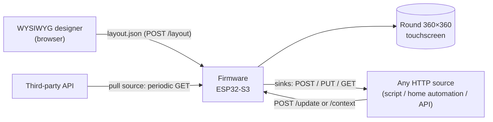

<p align="center">
  
</p>

<h1 align="center">Dialboard</h1>

<p align="center">
  <strong>Design dashboards in your browser and push them to a ~€15 <em>round</em> touchscreen.</strong>
</p>

<p align="center">
  <a href="https://sandjab.github.io/Dialboard/">Website</a> ·
  <a href="https://sandjab.github.io/Dialboard/docs/">Manual</a> ·
  <a href="https://github.com/Sandjab/dialboard-store">Community store</a>
</p>

<p align="center">
  
  
  
  
  
</p>

<p align="center">
  <strong>English</strong> · <a href="README.fr.md">Français</a>
</p>

---

Dialboard turns a low-cost **round** ESP32-S3 touchscreen (Guition JC3636K718, 360×360) into a
**config-driven dashboard**. A JSON layout describes pages and components; a **WYSIWYG designer**
— a static web app embedded on the device itself — edits that layout without recompiling; and
values are **pushed from any HTTP source** with a simple `POST /update`.

No app, no cloud account, no toolchain for day-to-day use: flash once, then design in the browser
and drive the screen from your scripts, home automation, or third-party APIs.

## Table of contents

- [Highlights](#highlights)
- [Hardware](#hardware)
- [How it works](#how-it-works)
- [Repository layout](#repository-layout)
- [Quick start](#quick-start)
- [Using the designer](#using-the-designer)
- [Components](#components)
- [Pushing data to the screen](#pushing-data-to-the-screen)
- [HTTP API](#http-api)
- [Layout format](#layout-format)
- [Build, test & flash](#build-test--flash)
- [Development](#development)
- [Tech stack](#tech-stack)
- [Limitations & security notes](#limitations--security-notes)
- [Links](#links)
- [Contributing](#contributing)

## Highlights

- **Config-driven** — the whole UI is one `layout.json`; no recompilation to change the screen.
- **WYSIWYG designer, embedded** — drag-and-drop editor served *by the device* over LittleFS
  (`http://<ip>/designer/`), also usable locally or from GitHub Pages. Multi-page, snap-to-anchor
  canvas, live schema validation, undo/redo, import/export.
- **Push from anywhere** — set a component's value directly by id (`POST /update`) or write a
  shared **context** blackboard (`POST /context`).
- **Pull sources** — the device can periodically `GET` third-party APIs and extract fields via
  JSON Pointer into the context (`temp`, `co2`, …).
- **Reactive sinks** — a UI interaction can `POST/PUT/GET` an external endpoint (home automation,
  webhooks) with debouncing — a bidirectional HTTP bus.
- **Input effectors** — switches, sliders, buttons, rollers, steppers, segmented controls write
  back to the context and reflect pushed values.
- **Runtime provisioning** — WiFi credentials via a **captive portal** (stored in NVS, not in the
  binary); API secrets via a write-only store, referenced as `$name` in headers.
- **Flash from the designer** — over-the-air firmware/filesystem updates on the LAN, and USB
  (Web Serial) flashing to bootstrap a blank device — no local toolchain required.
- **Parity by design** — a single JSON schema (`schema/layout.schema.json`) is the shared contract
  validated by both the designer and the firmware.

## Hardware

Primary target: **Guition JC3636K718**.

| | |
|---|---|
| MCU | ESP32-S3 (dual-core, PSRAM) |
| Display | 360×360 **round** IPS, ST77916 controller over QSPI |
| Touch | CST816 capacitive (single point) |
| Input | rotary encoder with push |
| Extras | addressable RGB ring (WS2812), audio, microSD slot |
| Flash | 16 MB (custom partition table with dual OTA app slots + LittleFS) |
| Cost | ~€15 |

The board layer (pins, init sequences, drivers) is isolated under `lib/board_k718/` with
`k718_*` symbols. The application identity is **Dialboard**; the board layer keeps a
board-specific identity to support porting to other round displays later.

## How it works

Three moving parts around one shared contract:



1. You **design** a layout in the browser and push it to the device; it is validated and persisted
   to flash.
2. The firmware **renders** it with LVGL and exposes a small HTTP API.
3. You **feed** it: push values directly, write the context, or let the device pull from APIs.
4. **Interactions** on the screen can trigger outbound HTTP calls (sinks).

The context/pull/push bus — the heart of Dialboard's data flow — is documented in depth in
[`context.md`](context.md), including concurrency, secrets resolution, and the sink lifecycle.

## Repository layout

```
src/                Firmware (C++/Arduino, LVGL 9.5): dashboard, view, api, net_pull/push, persist, nav…
lib/
  board_k718/       Board HAL (pins, ST77916 display, LVGL init, encoder, RGB ring) — k718_* symbols
  qspi_panel/       QSPI panel driver
  esp_lcd_touch*/   Vendored CST816 touch driver (not in the PlatformIO registry)
designer/           WYSIWYG editor (ES modules + node tests), embedded on-device via LittleFS
schema/             layout.schema.json — the shared contract (designer AND firmware)
data/               LittleFS image: layout.json (committed) + designer/ + schema/ (staged)
test/               Native core-logic tests (Unity, env:native)
tools/              stage_fs.sh (stage data/), push.py, gen_fonts.py
docs/               HTML manual (index.html)
site/               Bilingual landing page (GitHub Pages)
context.md          Deep dive: the context blackboard + pull/push bus
```

## Quick start

**Prerequisites:** [PlatformIO](https://platformio.org/) (CLI or IDE) and a USB cable. Node.js is
only needed to run the designer's tests. Python 3 + `fonttools`/`brotli` are only needed to
regenerate fonts.

```bash
# 1. Build and flash the firmware
pio run -e esp32s3 -t upload

# 2. Stage the designer + schema, then flash the LittleFS image
bash tools/stage_fs.sh
pio run -e esp32s3 -t uploadfs
```

**First boot — WiFi provisioning.** With no known network, the device opens an open access point
`Dialboard-XXXXXX` with a **captive portal** to enter your WiFi credentials, then reboots.
Credentials are stored in NVS (a separate partition — they survive `uploadfs`).

Once connected, the device is reachable at its DHCP IP (and `dialboard.local` via mDNS where
allowed). Open **`http://<ip>/designer/`** to start designing.

> ⚠️ `pio run -t uploadfs` rewrites the entire LittleFS filesystem, **erasing on-device assets**
> (uploaded images, `/secrets.json`). Back them up before reflashing the filesystem.

## Using the designer

The designer is a dependency-free, build-free static web app. Three ways to run it:

| Where | URL | Notes |
|---|---|---|
| **On the device** (recommended) | `http://<ip>/designer/` | Same-origin — Load/Push/Status/Screenshot work with zero config. |
| **GitHub Pages** | [sandjab.github.io/Dialboard/designer](https://sandjab.github.io/Dialboard/designer/) | Always up to date; device actions need the device on the same LAN. |
| **Locally** | `python3 -m http.server` from the repo root, then `/designer/` | Serve from the repo root (the designer loads `../schema/…`), not from `designer/`. |

Work is auto-saved to `localStorage`; **Export / Import** is the safety net for a `layout.json`
file. See [`designer/README.md`](designer/README.md) for the full editor guide.

**Flashing from the designer.** The designer can also update a device without a local toolchain:

- **OTA over LAN** — push a new firmware and/or filesystem image to an online device, with
  automatic dashboard preservation.
- **USB (Web Serial)** — bootstrap a blank or bricked device over USB, straight from the browser
  (Chromium-only). Requires a published firmware release.

## Components

Placed on pages via `pages[].place[]`; a single component id can appear on several pages and
shares its state. Available types (`designer/js/registry.js`, kept in sync with the schema):

- **Text & values** — `label`, `readout`, `clock`, `qr`
- **Indicators & gauges** — `bar`, `ring`, `rings` (concentric tracks), `arc`, `meter`, `chart`,
  `led` (on-screen indicator)
- **Media** — `image`, `image_anim`, `icon`
- **Shapes** — `rect`, `circle`, `line`
- **Effectors (input/action)** — `switch`, `button`, `slider`, `roller`, `stepper`, `segmented`
- **Physical (device hardware)** — `led_ring` (RGB ring), `sound` (buzzer)

Any effector can both **write** its bound context variable (on interaction) and **read** it back
(to reflect a value pushed from elsewhere).

## Pushing data to the screen

Two ways to drive a display component:

**By id — direct push.** For a component with an empty `bind`:

```bash
curl -X POST http://<ip>/update \
  -H 'Content-Type: application/json' \
  -d '{"cpu": 42, "status": "online"}'
```

**Via the context — a shared blackboard.** For a component whose `bind` names a variable:

```bash
curl -X POST http://<ip>/context \
  -H 'Content-Type: application/json' \
  -d '{"temp": 21.5}'
```

Any component with `bind: "temp"` follows the context; if the variable is absent it keeps its last
value (no flicker). Note that `POST /context` does **not** arm sinks — only UI interactions do.
See [`context.md`](context.md) for pull sources, sinks, and secrets.

## HTTP API

All routes are served on port 80 (`src/api.cpp`). No authentication (see
[security notes](#limitations--security-notes)).

| Route | Method | Purpose |
|---|---|---|
| `/update` | POST | Set **component** values by id (direct push). Does not touch the context. |
| `/context` | GET | Dump the blackboard `{name: value, …}` (optional `?vars=a,b`). |
| `/context` | POST | Apply `{name: value, …}` to the blackboard. Does not arm sinks. |
| `/status` | GET | Health & telemetry: `ip`, `uptime_s`, `page`, `pages`, `components`, `sd`, `sources[]`, `sinks[]`. |
| `/layout` | GET / POST | Read / replace the active layout (validated + persisted to flash). |
| `/secrets` | POST | Merge API secrets into `/secrets.json`. **Write-only** — no GET by design. |
| `/wifi` | GET / POST / DELETE | List (SSIDs only) / add-update / remove a stored network (NVS). Passwords never echoed. |
| `/wifi/scan` | GET | Networks currently visible to the device. |
| `/page` | POST | Navigate to a page (used by the designer's capture overlay). |
| `/screenshot` | GET | Pixel-perfect screen capture (`image/bmp`). |
| `/image`, `/bgimage`, `/aimg` | GET / POST | Upload/fetch placed images, background images, animated images. |
| `/firmware`, `/fs` | POST | OTA update of the app / the LittleFS image. |
| `/reboot` | POST | Software reboot (used by the OTA flow). |
| `/designer/`, `/schema/` | GET | Static: the embedded designer and shared schema. |

## Layout format

The single source of truth is [`schema/layout.schema.json`](schema/layout.schema.json) (JSON
Schema draft-07). The firmware is tolerant (it ignores unknown keys); the schema is intentionally
**stricter** (`additionalProperties: false`) so the designer catches typos.

A minimal layout — two concentric countdown rings on one page:

```json
{
  "title": "Dialboard",
  "background": "#0B0B0F",
  "components": {
    "w5h": { "type": "ring", "color": "#38BDF8", "countdown": true,
             "thresholds": [[70, "#22C55E"], [90, "#F59E0B"], [100, "#EF4444"]] },
    "w7d": { "type": "ring", "color": "#A78BFA", "countdown": true }
  },
  "pages": [
    { "name": "usage", "place": [
      { "ref": "w5h", "radius": 176, "thickness": 16, "gap_deg": 70 },
      { "ref": "w7d", "radius": 141, "thickness": 16, "gap_deg": 70 } ] }
  ]
}
```

Key ideas: **components** hold definitions (no position); **pages[].place[]** hold positions
(anchor + offset, or radius/thickness for rings). Display text supports **Latin-1** (embedded
fonts); component ids and asset keys are **ASCII**. Firmware limits (max 32 components, 8 pages,
12 placements/page, 6 sources/sinks…) are enforced by the schema for parity.

## Build, test & flash

```bash
pio run -e esp32s3                 # build firmware
pio test -e native                 # core-logic tests (no HW/LVGL)
cd designer && node --test         # designer tests (invoke WITHOUT arguments)
bash tools/stage_fs.sh             # stage designer/ + schema/ -> data/ before uploadfs
pio run -e esp32s3 -t upload       # flash firmware (USB port auto-detected)
pio run -e esp32s3 -t uploadfs     # flash the LittleFS image (designer + schema + layout)
```

## Development

- **Firmware core logic** is factored into pure modules tested natively (`env:native`, Unity) —
  no hardware or LVGL needed. See `build_src_filter` in `platformio.ini` for the covered files.
- **Designer** is plain ES modules with node tests: `cd designer && node --test`. DOM-heavy code
  is browser-verified; pure logic is unit-tested.
- **Fonts** are rendered via Tiny TTF at any size. To regenerate the embedded font arrays and the
  designer's parity `.woff2` files: `python3 tools/gen_fonts.py` (needs `fonttools` + `brotli`).
  The generated `.c`/`.woff2` are committed.
- **Schema evolution** is a dedicated commit on `schema/layout.schema.json` (the shared contract),
  since both the designer and the firmware consume it.

## Tech stack

- **Firmware** — C++/Arduino on ESP32-S3, [LVGL 9.5](https://lvgl.io/),
  [ArduinoJson 7](https://arduinojson.org/), Adafruit NeoPixel, built with
  [PlatformIO](https://platformio.org/) (pioarduino platform).
- **Storage** — LittleFS (layout, designer, schema, assets) + NVS (WiFi credentials).
- **Designer** — vanilla JavaScript ES modules, no build step; ajv for live validation;
  esptool-js (vendored) for USB flashing.
- **Site** — static bilingual landing page on GitHub Pages.

## Limitations & security notes

- **Unauthenticated LAN server** — anyone on the network can read the API and push layouts/values.
- **Secrets at rest are unencrypted** — `/secrets.json` on LittleFS and WiFi credentials in NVS
  are stored in clear text; a physical dump can read them. They are, however, no longer baked into
  the firmware binary.
- **Outbound HTTPS uses `setInsecure()`** — certificates are not verified (no MITM protection).
- **Mixed content** — the HTTPS GitHub Pages designer cannot talk to a plain-HTTP device on the
  LAN; use the device-served or locally-served designer for device actions.
- **Single display, static limits** — everything is fixed-size (no heap for the model): 32
  components, 8 pages, 32 context variables, etc. Overflow is dropped silently.
- **`uploadfs` erases on-device assets** — back up uploaded images and `/secrets.json` first.

## Links

- **Website** — https://sandjab.github.io/Dialboard/
- **Manual** — https://sandjab.github.io/Dialboard/docs/
- **Community store** (shareable `.dboard` dashboards) — https://github.com/Sandjab/dialboard-store
- **Context/pull/push deep dive** — [`context.md`](context.md)
- **Designer guide** — [`designer/README.md`](designer/README.md)

## Contributing

Issues and pull requests are welcome on
[github.com/Sandjab/Dialboard](https://github.com/Sandjab/Dialboard). When changing the layout
format, update `schema/layout.schema.json` first (it is the contract shared by the designer and the
firmware), and keep the designer's rendering in parity with `src/view.cpp` / `src/dashboard.cpp`.

## License

Released under the [MIT License](LICENSE).
