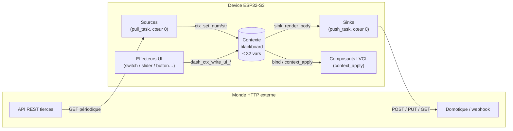
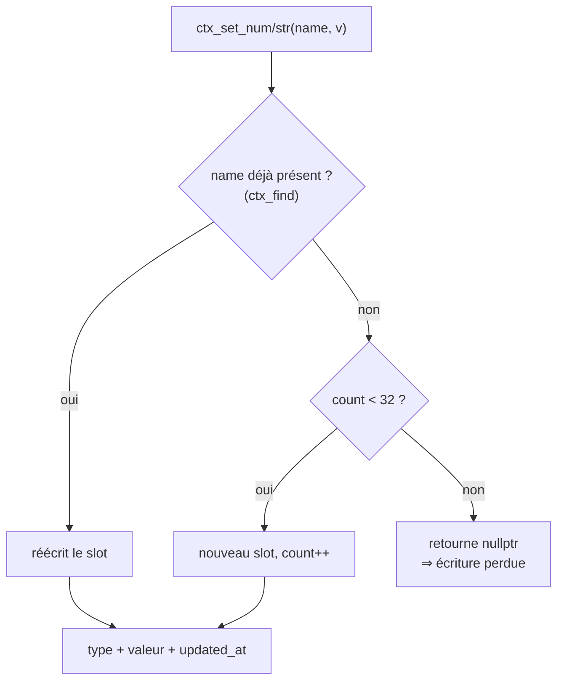
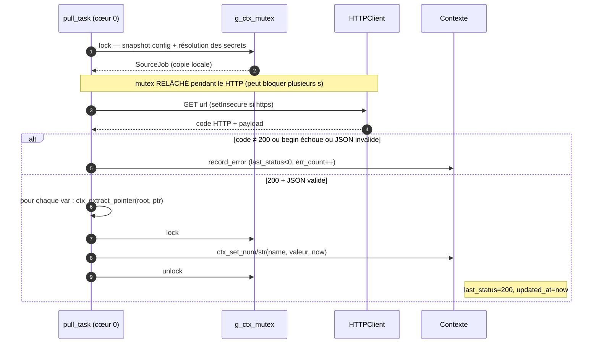
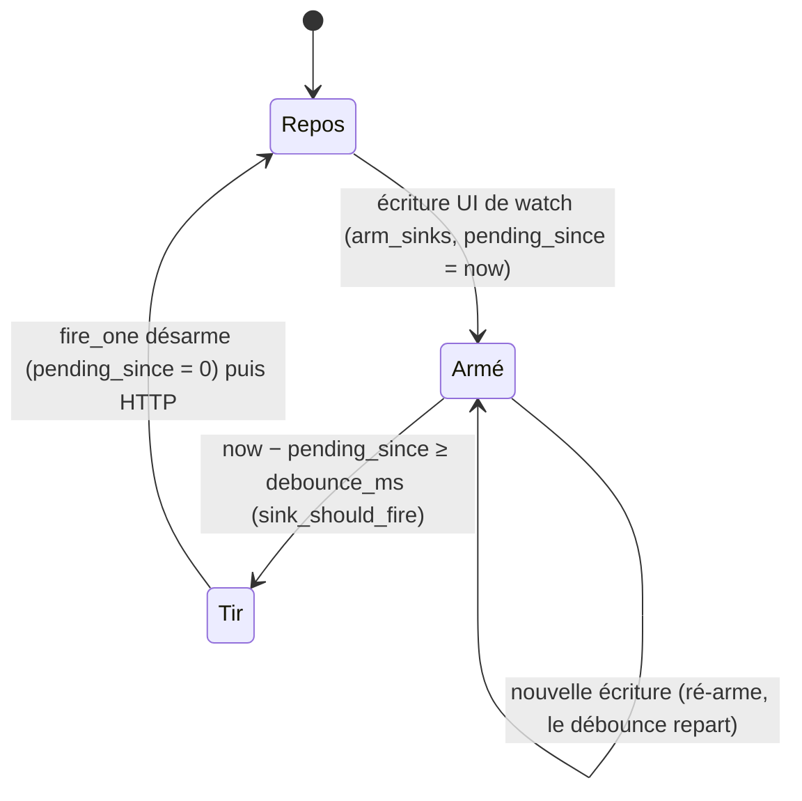
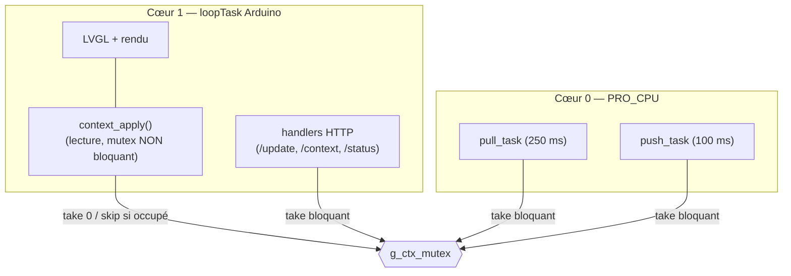
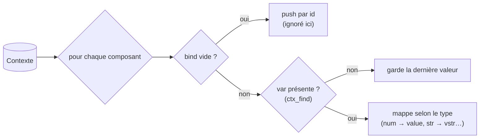
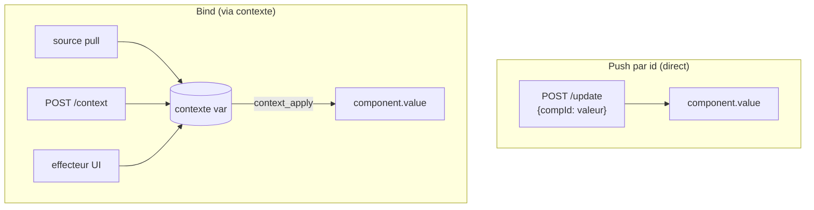

# Le contexte Dialboard — pull & push

Ce document explique **le contexte** (le *blackboard* partagé du firmware) et les deux voies
qui l'alimentent et le consomment :

- **Pull** (entrée) : des **sources** HTTP tirent des données du monde extérieur *dans* le contexte.
- **Push** (sortie) : des **sinks** poussent des valeurs du contexte *vers* le monde extérieur.

Le tout forme un **bus bidirectionnel** dont le contexte est le point de rendez-vous.

Fichiers de référence : `src/context.{h,cpp}`, `src/net_pull.cpp`, `src/net_push.cpp`,
`src/sink.{h,cpp}`, `src/dashboard.{h,cpp}`, `src/api.cpp`, `src/main.cpp`, `src/view.cpp`.

---

## 1. Vue d'ensemble

Le contexte est un **tableau fixe de variables nommées** (un « tableau noir » que tout le monde
peut lire et écrire). Il découple **qui produit** une valeur de **qui la consomme** : une source,
un `POST /context` ou un effecteur tactile écrit `temp = 21.5`, et n'importe quel composant
lié (`bind`) ou sink observateur (`watch`) réagit — sans se connaître.



| Rôle | Sens | Déclencheur | Écrit / lit le contexte |
|------|------|-------------|--------------------------|
| **Source** | entrée (pull) | timer `interval_s` | **écrit** via `ctx_set_*` |
| **`POST /context`** | entrée | requête HTTP | **écrit** via `ctx_apply_json` |
| **Effecteur UI** | entrée | tap / drag sur l'écran | **écrit** via `dash_ctx_write_ui_*` |
| **Composant lié (`bind`)** | sortie (affichage) | boucle `context_apply` | **lit** |
| **Sink** | sortie (push) | écriture de la var `watch` | **lit** via `sink_render_body` |

> À ne pas confondre : `POST /update` **ne touche pas le contexte**. Il écrit *directement* la
> valeur d'un composant par son `id` (mode « push par id », `bind` vide). Le contexte n'entre en
> jeu que pour les composants dont le `bind` nomme une variable. Voir §7.

---

## 2. Structure du contexte

Défini dans `src/context.h`.

```c
enum CtxType { CTX_NONE, CTX_NUM, CTX_STR };   // le type d'une variable

struct CtxVar {              // une variable nommée du blackboard
    char     name[ID_LEN];   // clé, ex. "temp"           (ID_LEN   = 24)
    CtxType  type;           // CTX_NUM | CTX_STR
    double   num;            //   valeur si numérique
    char     str[TEXT_LEN];  //   valeur si chaîne         (TEXT_LEN = 32)
    uint32_t updated_at;     // millis() device du dernier set
};

struct Context {
    CtxVar vars[MAX_CTX_VARS];  // MAX_CTX_VARS = 32, tableau statique (pas de heap)
    int    count;               // nb de slots occupés
};
```

**Deux types de valeurs seulement** (`num` **XOR** `str` selon `type`) :

| Type | Stockage | Accepté à l'entrée |
|------|----------|--------------------|
| `CTX_NUM` | `double num` | nombre JSON (`float` / `int`) |
| `CTX_STR` | `char str[32]` | chaîne JSON |

À l'ingestion, **objet / tableau / booléen / null sont ignorés en v1** — seuls nombre et chaîne
entrent (`ctx_apply_json`, `src/context.cpp:34`).

**Accès** — indexation linéaire par nom (`ctx_find`), création de slot à la volée (`ctx_slot`) :



### Garde du plein — pas d'alerte

Quand `count >= MAX_CTX_VARS` (32), `ctx_slot` renvoie `nullptr` et `ctx_set_*` renvoient `false`
(`src/context.cpp:14,22,29`). **Mais aucun appelant ne remonte ce `false`** : une 33ᵉ variable est
**silencieusement abandonnée** — pas de log, pas de code d'erreur HTTP, pas de compteur exposé.
`POST /context` répond quand même `{"ok":true}`. Voir aussi §8.

---

## 3. Pull — les sources (entrée)

Une **source** décrit un `GET` HTTP périodique dont on extrait une ou plusieurs variables via
**JSON Pointer**. Structure (`src/dashboard.h:131`) :

```c
struct SourceHeader { char name[32]; char value[64]; };  // value: littéral ou "$secret"
struct SourceVar    { char name[24]; char ptr[48];   };  // variable  ->  JSON Pointer

struct Source {
    char         name[24];
    char         url[192];
    uint32_t     interval_s;                 // cadence de rafraîchissement
    SourceHeader headers[4];  int header_count;
    SourceVar    vars[6];     int var_count;  // plusieurs vars par source
    // --- runtime / télémétrie ---
    uint32_t     last_fetch_ms;   // 0 = jamais -> fetch immédiat
    int          last_status;     // dernier code HTTP, <0 si transport/parse
    uint32_t     err_count;
    uint32_t     updated_at;      // millis() du dernier fetch réussi
};
```

### Boucle et cadence (`net_pull.cpp`)

Une tâche FreeRTOS **`pull_task`** épinglée sur le **cœur 0**, pile 16 Ko (handshake TLS mbedtls),
réveil toutes les **250 ms** :

- Ne travaille que si `WiFi` connecté.
- Source « due » si `last_fetch_ms == 0` (jamais) **ou** `now - last_fetch_ms >= interval_s·1000`.
- **Marque `last_fetch_ms = now` *avant* le fetch** (anti double-tir si le fetch traîne).

### Un fetch, étape par étape (`fetch_one`)



Détails notables :

- **Copie locale d'abord** (`SourceJob`) : la config est copiée sous mutex, puis le mutex est
  **relâché pendant le HTTP** — le reste du firmware n'est pas gelé le temps du réseau.
- **Secrets** : un header dont la valeur est `"$nom"` est résolu via le store de secrets
  (`resolve_header`) ; sinon la valeur est littérale. Permet de committer un layout sans clé d'API.
- **JSON Pointer (RFC 6901)** — `ctx_extract_pointer` (`src/context.cpp:70`) navigue la réponse :
  `"/main/temp"`, `"/list/0/value"`, avec déséchappement `~1`→`/` et `~0`→`~`.
- **Pointeur non résolu** (`isNull`) ⇒ la variable **garde sa dernière valeur** (on saute, on
  n'écrase pas avec du vide) — `net_pull.cpp:84`.

### Codes d'erreur d'une source (`last_status`)

| Valeur | Signification |
|--------|---------------|
| `200` | dernier fetch OK (`updated_at` mis à jour) |
| `-1` | `http.begin` a échoué (URL / TLS) |
| `-2` | réponse non-JSON (`deserializeJson` en échec) |
| autre `> 0` | code HTTP renvoyé par le serveur (404, 500…) |

Exposée par `GET /status` → tableau `sources[]`, affichée dans l'onglet **Device** du designer.

---

## 4. Push — les sinks (sortie)

Un **sink** observe **une** variable (`watch`) : dès qu'elle est **écrite depuis l'UI**, le sink
est *armé*, puis (après un éventuel débounce) **tire** une requête HTTP dont le corps est rendu à
partir du contexte. Structure (`src/dashboard.h:150`) :

```c
enum SinkMethod : uint8_t { SINK_POST = 0, SINK_PUT, SINK_GET };

struct Sink {
    char        name[24];
    char        watch[24];          // var observée ; son écriture UI arme ce sink
    SinkMethod  method;             // POST par défaut
    char        url[192];
    SinkHeader  headers[4];  int header_count;
    char        body[192];          // gabarit ; "" => corps par défaut {"<watch>": <val>}
    uint32_t    debounce_ms;
    // --- runtime ---
    uint32_t    pending_since;      // 0 = non armé ; sinon millis() de la dernière écriture UI
    int         last_status;        // dernier code HTTP, <=0 si transport
    uint32_t    err_count;
    uint32_t    fired_at;           // millis() du dernier tir réussi
    char        captured_body[…];   // momentary : corps figé au tap
    bool        has_capture;
};
```

### Cycle de vie d'un sink



### Armement (`arm_sinks`, `dashboard.cpp:521`)

Toute écriture **d'origine UI** d'une variable arme les sinks qui l'observent : pour chaque sink
tel que `watch == var`, `pending_since = now`. Deux modes :

- **live** (`capture=false`) : le corps sera rendu **au moment du tir** (valeur fraîche).
- **momentary** (`capture=true`) : le corps est **figé maintenant** dans `captured_body` (impulsion
  bouton — la valeur est capturée au tap même si elle retombe à 0 juste après).

> `POST /context` et les **sources** écrivent le contexte **sans armer** de sink (ils passent par
> `ctx_apply_json` / `ctx_set_*`, pas par `dash_ctx_write_ui_*`). Seule l'UI arme — c'est
> volontaire : un sink pousse une action *utilisateur*, pas un rafraîchissement entrant.

### Tir (`push_task` / `fire_one`, `net_push.cpp`)

Tâche **`push_task`** épinglée **cœur 0**, pile 16 Ko, réveil toutes les **100 ms** (réactif ; le
débounce vit dans le sink via `sink_should_fire`).

```mermaid
sequenceDiagram
    autonumber
    participant P as push_task (cœur 0)
    participant M as g_ctx_mutex
    participant C as Contexte
    participant H as HTTP externe

    loop toutes les 100 ms
        P->>P: sink_should_fire(pending_since, now, debounce_ms) ?
    end
    P->>M: lock — snapshot config + secrets + rendu du corps
    alt momentary
        C-->>P: captured_body (figé au tap), has_capture=false
    else live
        P->>C: sink_render_body(body, watch, ctx)
    end
    P->>P: pending_since = 0 (désarme AVANT le tir)
    P->>M: unlock
    P->>H: POST / PUT / GET url + corps (Content-Type: application/json)
    H-->>P: code
    Note right of P: code>0 -> fired_at=now ; code<=0 -> err_count++
```

### Rendu du corps (`sink_render_body`, `src/sink.cpp:19`)

Deux modes selon `body` :

- **Corps par défaut** (`body == ""`) — JSON **typé** à partir de la var observée :
  `{"<watch>": <valeur>}` (nombre, chaîne, ou `null` si la var est absente).
- **Gabarit textuel** — chaque `{{nom}}` est remplacé par le **texte** de la variable `nom` :
  - nombre : entier si entier, sinon `%g` ;
  - chaîne : caractères bruts (sans guillemets).
  - **L'auteur met les guillemets** s'il veut une chaîne JSON. Exemple de gabarit :
    `{"state":"{{lampe}}","level":{{niveau}}}`.

---

## 5. Concurrence — 3 tâches, 1 mutex

Le contexte, les sources et les sinks sont partagés par **trois tâches** ; l'accès est sérialisé
par **`g_ctx_mutex`** (`src/main.cpp:25`).



Règles :

- Le mutex n'est **jamais** tenu pendant un appel HTTP : chaque tâche **snapshot** sous mutex, puis
  relâche avant le réseau (`SourceJob` / `SinkJob`).
- `context_apply` (boucle d'affichage) prend le mutex en **non bloquant** (`take(0)`) et **saute le
  tour** s'il est occupé (`src/main.cpp:102`) — l'UI ne bloque jamais sur le réseau.
- Les handlers HTTP et les effecteurs UI prennent le mutex en **bloquant** (attente brève garantie).

---

## 6. Consommation par les composants — `bind`

Un composant d'affichage peut porter un **`bind`** = le nom d'une variable du contexte
(`Component.bind`, `src/dashboard.h:60`). La boucle **`context_apply`** (`dashboard.cpp:559`)
recopie, à chaque tour, la valeur de la variable vers l'état du composant :



- `bind` **vide** ⇒ le composant est piloté **par son id** via `POST /update` (voir §7).
- `bind` **renseigné** ⇒ le composant **lit le contexte** ; si la variable est absente, il garde sa
  dernière valeur (pas de clignotement).

Un même composant **effecteur** (switch, slider, arc, roller, button) peut à la fois **écrire** sa
var au `bind` (interaction) *et* la **relire** via `context_apply` (reflet) — c'est ce qui permet à
un slider de suivre une valeur poussée par ailleurs.

---

## 7. Deux façons de piloter un afficheur



| | Push par id | Bind (contexte) |
|--|-------------|-----------------|
| `bind` | vide | nom de variable |
| Écriture | `POST /update {id: v}` | source / `POST /context` / effecteur UI |
| Découplage | aucun (1 émetteur → 1 composant) | total (N émetteurs ↔ N lecteurs/sinks) |
| Réactif à l'UI (sinks) | non | oui (via `watch`) |

---

## 8. API HTTP

| Route | Méthode | Effet | Réponse |
|-------|---------|-------|---------|
| `/update` | POST | valeurs de **composants** par id (push par id). N'écrit **pas** le contexte. | `{ok, updated, unknown}` |
| `/context` | GET | dump du blackboard `{nom: valeur, …}`. Filtre optionnel `?vars=a,b,c`. | objet JSON |
| `/context` | POST | applique `{nom: valeur, …}` au blackboard (`dash_set_context`). N'arme **pas** de sink. | `{"ok":true}` (même si vars perdues) |
| `/status` | GET | santé + télémétrie : `ip, uptime_s, page, pages, components, sd, sources[], sinks[]`. | objet JSON |

- `unknown` (réponse `/update`) = **id de composants introuvables**, **sans rapport** avec le plein
  du contexte.
- L'onglet **Device** du designer combine `GET /context` (table Vars) + `GET /status` (tables
  Sources / Sinks), et calcule l'âge de chaque var contre `uptime_s` du device
  (`designer/js/device.js`, `formatDeviceDump`).

---

## 9. Dimensionnement (`src/config.h`)

| Constante | Valeur | Rôle |
|-----------|--------|------|
| `MAX_CTX_VARS` | 32 | variables du contexte |
| `ID_LEN` | 24 | longueur d'un nom (var, id de composant) |
| `TEXT_LEN` | 32 | longueur d'une valeur chaîne |
| `MAX_SOURCES` | 6 | sources pull |
| `MAX_VARS_PER_SOURCE` | 6 | variables extraites par source |
| `MAX_HEADERS_PER_SOURCE` | 4 | headers HTTP par source |
| `MAX_SINKS` | 6 | sinks push |
| `MAX_HEADERS_PER_SINK` | 4 | headers HTTP par sink |
| `SINK_BODY_LEN` | 192 | gabarit de corps d'un sink |
| `URL_LEN` | 192 | URL source / sink |
| `PTR_LEN` | 48 | JSON Pointer d'extraction |
| `HEADER_NAME_LEN` / `HEADER_VAL_LEN` | 32 / 64 | header HTTP |

Toutes ces limites sont **fixes** (tableaux statiques, pas de heap) et **gardées côté designer**
(parité avec le firmware). Dépassement du contexte ⇒ abandon silencieux (§2).

---

## Récapitulatif d'une boucle complète

1. **Pull** — `pull_task` GET une API toutes les `interval_s`, extrait `temp` via JSON Pointer,
   écrit `ctx.temp = 21.5`.
2. **Affichage** — `context_apply` recopie `ctx.temp` vers le readout dont `bind == "temp"`.
3. **Action** — l'utilisateur bouge un slider `bind == "consigne"` : `dash_ctx_write_ui_num` écrit
   `ctx.consigne` **et** arme le sink qui `watch: "consigne"`.
4. **Push** — après `debounce_ms`, `push_task` rend le corps depuis le contexte et POST vers la
   domotique.
