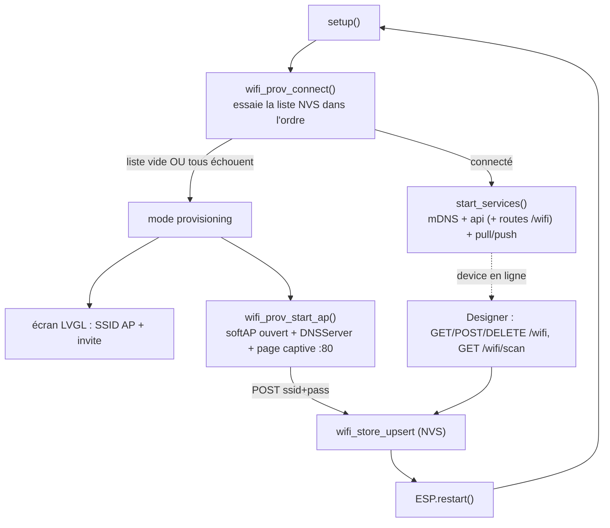

# Provisioning WiFi — portail captif + store NVS multi-réseaux + gestion designer

> Statut : design validé (brainstorming). Prochaine étape : plan d'implémentation (writing-plans).
> Date : 2026-07-02.

## But

Remplacer les identifiants WiFi **compilés** (`src/secrets.h` : `WIFI_SSID`/`WIFI_PASS`) par un
**provisioning à l'exécution** : une liste de réseaux stockée en NVS, essayée au boot dans l'ordre,
avec repli sur un **portail captif** (AP + page de saisie) quand aucun réseau connu ne répond. La
liste est aussi gérable **depuis le designer**. Objectif final : **supprimer définitivement
`secrets.h`** (et `secrets.h.example`).

Bénéfice sécurité net : les identifiants WiFi ne sont plus dans le binaire (un dump firmware ne les
fuite plus) ; ils vivent en NVS, résolus au runtime.

## Décisions verrouillées (brainstorming)

| Sujet | Décision |
|-------|----------|
| Stockage | **NVS** (`Preferences`), pas LittleFS → **survit à `uploadfs`** (partitions distinctes ; seul `erase_flash` l'efface). Partition `nvs` présente dans `default_16MB.csv`. |
| Modèle | **Liste** d'au plus `MAX_WIFI_NETS` réseaux `{ssid, pass}`. |
| Connexion boot | **Ordre strict** de la liste, timeout par essai. |
| Repli | **AP ouvert éphémère** (`Dialboard-XXXXXX`) + `DNSServer` catch-all + page captive. Actif seulement en mode provisioning. |
| Écran device | En mode provisioning, écran LVGL minimal : nom de l'AP + invite (« rejoins ce WiFi puis ouvre 192.168.4.1 »). |
| Gestion designer | **Panneau dédié** gaté par un réglage (comme `deviceContext`). |
| Sécurité pass | **Write-only** partout (portail + `/wifi`) : on écrit/lister des SSID, on **ne relit jamais** un mot de passe (miroir de `/secrets`, cf. `context.md` §5). |
| Périmètre | Suppression de `secrets.h` + `.example`. |

## Hors périmètre (notés pour plus tard)

- **Écran de config on-device** pour re-déclencher le provisioning / gérer la liste (le « à faire »
  mentionné). Le store NVS + `wifi_prov_start_ap()` rendent cet ajout trivial ensuite.
- **« Reconnect now »** depuis le designer sans reboot : les changements de liste prennent effet au
  prochain boot / prochain essai de connexion.
- Chiffrement au repos du NVS et authentification du serveur web : lacunes existantes du projet
  (déjà vraies pour `/secrets.json`), suivies séparément — pas régressées, pas résolues ici.

## Architecture

Deux modules firmware + un panneau designer. Frontière volontairement identique à l'existant :
**logique pure testable** (comme `context.cpp`) séparée des **I/O** (NVS, WiFi, HTTP).



### Module 1 — `wifi_list` (cœur pur) + `wifi_store` (persistance NVS)

**`src/wifi_list.{h,cpp}` — pur, testable en natif** (ajouté à `build_src_filter` de `env:native`,
comme `context.cpp`/`sink.cpp`).

```c
struct WifiNet { char ssid[33]; char pass[64]; };   // SSID ≤ 32 + NUL ; PSK ≤ 63 + NUL

int  wifi_list_parse(const char* json, WifiNet* out, int max);            // {"nets":[{ssid,pass},…]} -> count
void wifi_list_serialize(const WifiNet* nets, int count, char* out, size_t n);
int  wifi_list_upsert(WifiNet* nets, int* count, int max,
                      const char* ssid, const char* pass);                // index ; -1 si plein & ssid absent
bool wifi_list_remove(WifiNet* nets, int* count, const char* ssid);       // false si absent
```

- `upsert` : remplace l'entrée de même SSID (met à jour le pass), sinon ajoute ; `-1` si plein.
- Tailles bornées par `strlcpy` (SSID/PSK tronqués proprement).
- Sérialisation ArduinoJson (dispo en natif, cf. tests `context`).

**`src/wifi_store.{h,cpp}` — enrobe le cœur avec NVS.** Namespace Preferences `"dbwifi"`,
une clé `"nets"` = blob JSON.

```c
void wifi_store_begin();                                        // Preferences.begin("dbwifi")
int  wifi_store_load(WifiNet* out, int max);                    // liste complète (pass inclus) — usage interne boot
int  wifi_store_list_ssids(char out[][33], int max);            // SSID seuls — pour GET /wifi
bool wifi_store_upsert(const char* ssid, const char* pass);     // charge -> upsert -> sauve ; false si plein
bool wifi_store_remove(const char* ssid);                       // charge -> remove -> sauve ; false si absent
```

- Chaque mutation = load JSON → cœur pur → serialize → `putString`. NVS absent/corrompu → liste vide,
  jamais d'échec dur (miroir `secret_store::load_doc`).

### Module 2 — `wifi_prov` (machine à états + portail AP)

**`src/wifi_prov.{h,cpp}`**

```c
const char* wifi_prov_connect();   // STA ; essaie la liste dans l'ordre ; SSID connecté ou nullptr
void        wifi_prov_start_ap();   // mode provisioning : softAP+DNS+serveur ; ne rend qu'via ESP.restart()
```

- `wifi_prov_connect` : `WiFi.mode(WIFI_STA)` ; charge via `wifi_store_load` ; pour chaque réseau,
  `WiFi.begin(ssid,pass)` puis attente ≤ `WIFI_ATTEMPT_TIMEOUT_MS` en pompant `lv_timer_handler()` ;
  renvoie le SSID au premier succès. Liste vide → renvoie `nullptr` d'emblée.
- `wifi_prov_start_ap` :
  - Nom AP `Dialboard-XXXXXX` (6 hex de la MAC). `WiFi.mode(WIFI_AP)`, `WiFi.softAP(name)` (**ouvert**).
  - `DNSServer` sur :53, catch-all `"*"` → IP de l'AP (détection de portail captif).
  - `WebServer` minimal :80 :
    - `GET /` + URLs de détection captive (`/generate_204`, `/hotspot-detect.html`, …) → **page HTML
      embarquée en C** (aucune dépendance LittleFS en mode AP).
    - `GET /scan` → `[{ssid,rssi},…]` (`WiFi.scanNetworks`).
    - `POST /save` `{ssid,pass}` → `wifi_store_upsert` → réponse OK → `ESP.restart()` (différé court).
  - Boucle propre pompant `lv_timer_handler()` + `dns.processNextRequest()` + `server.handleClient()` ;
    ne se termine **que** par reboot. Le provisioning est un **mode distinct** (pas de double-mode dans
    `loop()`).
- Écran LVGL minimal (helper dans `view.{h,cpp}`, ex. `view_show_provisioning(const char* ap_name)`) :
  texte centré « Configuration WiFi — rejoins **Dialboard-XXXXXX** puis ouvre http://192.168.4.1 ».

### Intégration `main.cpp`

- `setup()` : après `view_rebuild`, remplacer `g_wifi_up = wifi_connect();` par :
  ```
  const char* ssid = wifi_prov_connect();
  if (ssid) { start_services(); g_wifi_up = true; }
  else      { view_show_provisioning(ap_name); wifi_prov_start_ap(); }  // ne revient pas (reboot)
  ```
- Supprimer `#include "secrets.h"` et `wifi_connect()` (l'ancienne, à base de `WIFI_SSID/WIFI_PASS`).
- `wifi_store_begin()` appelé au boot (après `persist_begin`, comme `secret_store_begin`).
- `loop()` inchangé pour le mode STA (le provisioning ne rend jamais la main).

### Routes HTTP (mode STA) — `api.cpp`

Miroir write-only de `/secrets`. CORS déjà global (`enableCORS(true)` + `OPTIONS` 204).

| Route | Méthode | Effet | Réponse |
|-------|---------|-------|---------|
| `/wifi` | GET | liste des réseaux stockés (SSID seuls) + SSID courant | `{ "nets": ["A","B"], "connected": "A" }` |
| `/wifi` | POST | `{ssid,pass}` → `wifi_store_upsert`. Pass **jamais** ré-écho. | `{"ok":true}` / 400 (JSON/ssid vide) / 507 (plein) |
| `/wifi` | DELETE | `?ssid=…` → `wifi_store_remove` | `{"ok":true}` / 404 (absent) |
| `/wifi/scan` | GET | réseaux visibles (`WiFi.scanNetworks`) | `[{"ssid":"…","rssi":-63}, …]` |

- `connected` = `WiFi.SSID()`.
- Enregistrer `HTTP_DELETE` et le `OPTIONS` (préflight) comme les autres routes.

### Designer — panneau « WiFi »

- **Transport** (`designer/js/device.js`, via `devFetch` instrumenté) :
  `getWifi(base)`, `scanWifi(base)`, `addWifi(base, ssid, pass)`, `removeWifi(base, ssid)`.
- **`designer/js/wifi.js`** (miroir `sources.js`/`sinks.js`) : rend la liste des SSID stockés (le SSID
  `connected` marqué), un formulaire d'ajout (SSID via liste déroulante issue de `/wifi/scan` **ou**
  saisie manuelle + champ mot de passe), boutons de suppression. **Champ pass write-only** : jamais
  pré-rempli, jamais reçu du device.
- **Réglage `deviceWifi`** (`settings.js`) affichant le panneau (comme `deviceContext`), câblage
  `app.js` + conteneur `index.htm` + règle `style.css` `[hidden]{display:none}` (l'auteur l'emporte
  sur la règle UA — cf. note « panneaux console masqués »).
- **i18n** : clés dans `designer/i18n/fr.json` **et** `designer/i18n/en.js`.
- **Tests** `designer/tests/wifi.test.js` (`node --test`) : rendu de la liste, marqueur `connected`,
  invariant « le pass n'est jamais lu depuis le device ».

## Gestion d'erreur (récap)

- NVS absent/corrompu → liste vide (jamais d'échec dur).
- `upsert` sur store plein (et SSID absent) → 507 explicite.
- Tous réseaux KO au boot → portail (plus le cul-de-sac actuel « services non démarrés »).
- Scan raté → saisie SSID manuelle possible (portail et designer).
- Pass write-only : `GET /wifi` ne renvoie que des SSID.

## Sécurité

✅ Amélioration : identifiants WiFi hors binaire (dump firmware ne les fuite plus).
✅ Pass write-only (portail + `/wifi`) ; `GET` ne les renvoie jamais.
⚠️ Inchangé vs modèle existant : PSK stockés **en clair** dans NVS (comme `/secrets.json` en clair) ;
serveur web **non authentifié** sur le LAN (quelqu'un du réseau peut ajouter/supprimer un réseau, sans
pouvoir relire les pass) ; **AP de provisioning ouvert** → toute personne à portée pendant la fenêtre
de provisioning peut atteindre le portail (mitigé par l'éphémérité : AP actif seulement en
provisioning).

## Tests

- **Natif** (`test/`, Unity, `env:native`) : `wifi_list_*` purs — `upsert` (remplace/ajoute/plein),
  `remove` (présent/absent), round-trip `serialize`↔`parse`, troncature SSID/PSK. Ajouter
  `wifi_list.cpp` à `build_src_filter`.
- **Designer** (`node --test`) : `wifi.test.js`.
- **On-device (manuel)** : device NVS vide → AP `Dialboard-XXXXXX` visible + écran d'invite → saisie
  réseau → connexion → gestion liste via designer → `uploadfs` → **identifiants survivent** (NVS).

## Fichiers

**Nouveaux** : `src/wifi_list.{h,cpp}`, `src/wifi_store.{h,cpp}`, `src/wifi_prov.{h,cpp}`,
`designer/js/wifi.js`, `designer/tests/wifi.test.js`, `test/test_wifi_list/` (natif).

**Modifiés** : `src/main.cpp` (boot, retrait `secrets.h`), `src/api.cpp` (routes `/wifi`),
`src/config.h` (`MAX_WIFI_NETS`, `WIFI_ATTEMPT_TIMEOUT_MS`, préfixe AP), `src/view.{h,cpp}`
(écran provisioning), `platformio.ini` (`build_src_filter` += `wifi_list.cpp`),
`designer/js/device.js`, `designer/js/app.js`, `designer/js/settings.js`, `designer/index.htm`,
`designer/style.css`, `designer/i18n/fr.json`, `designer/i18n/en.js`, `.gitignore` (retrait ligne
`src/secrets.h`), `context.md` (§5 : WiFi désormais runtime), `docs/_internal/HANDOFF.md`.

**Supprimés** : `src/secrets.h` (local, gitignoré), `src/secrets.h.example`.

## Défauts de dimensionnement (config.h)

| Constante | Valeur proposée | Rôle |
|-----------|-----------------|------|
| `MAX_WIFI_NETS` | 5 | réseaux stockés |
| `WIFI_ATTEMPT_TIMEOUT_MS` | 8000 | timeout par réseau au boot |
| préfixe AP | `"Dialboard-"` + 6 hex MAC | nom du softAP |

## À vérifier en implémentation

- `Preferences`/NVS opérationnel avec `default_16MB.csv` (partition `nvs` présente — attendu OK).
- URLs de détection de portail captif à couvrir (iOS `/hotspot-detect.html`, Android
  `/generate_204`, Windows `/ncsi.txt`) → toutes servent la page de config.
- `WiFi.scanNetworks` en mode AP (pour `/scan` du portail) : scan en AP possible mais peut nécessiter
  `WIFI_AP_STA` — à confirmer sur cible ; repli saisie manuelle sinon.
